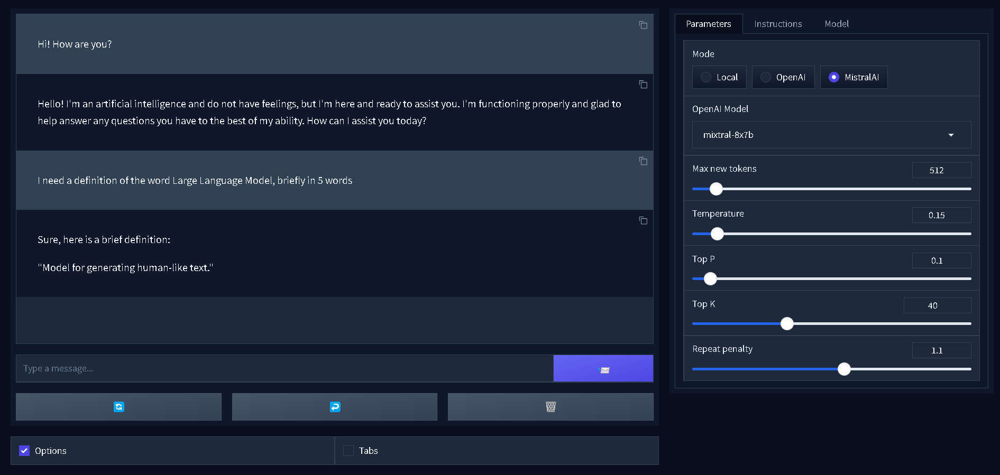
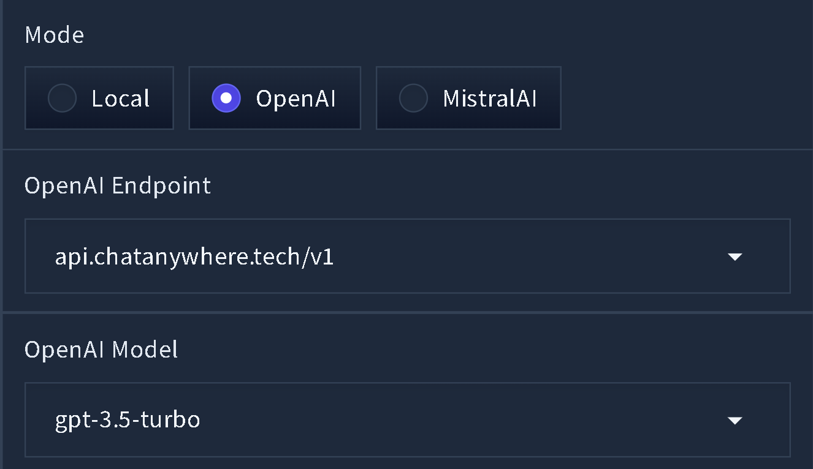
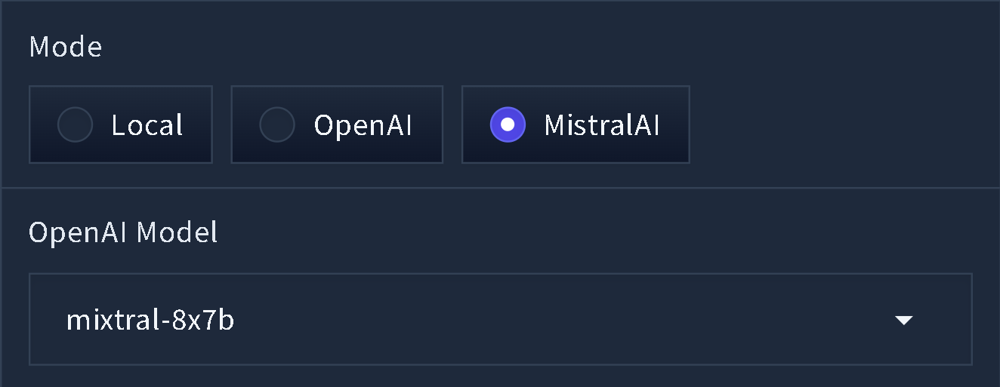

# **TensorLM** - webui for LLM models



*This is Fooocus from the world of Stable Difusion in the world of Text Generation, the same ease of use and the same convenience.*

This is simple and modern [Gradio](https://gradio.app) webui for LLM models GGML format (.bin) or GGUF format (.gguf) based on LLaMA.

We can try this app online in very slow demo of 3.0.0 version: <a target="_blank" href="https://huggingface.co/spaces/ehristoforu/TensorLM-webui-for-HF">
  
</a>

---
Navigation: \
[**Installing**](#installing) \
[**Presets**](#presets) \
[**Model downloading**](#model-downloading) \
[**API**](#api) \
[**Args**](#args)
---

## Fast use

You can use this webui in cloud service Colab: <a target="_blank" href="https://colab.research.google.com/github/ehristoforu/TensorLM-webui/blob/dev/assets/TensorLM_colab.ipynb">
  
</a>

## Features

- Simple to use
- Comfy to work
- Not demanding on resources
- Beautiful and pleasant interface
- Support GGML and GGUF format (.bin and .gguf)
- Support OpenAI API and MistralAI API

## Installing

### In Windows

[**>>> Portable one-click packege <<<**](https://github.com/ehristoforu/TensorLM-webui/releases/download/latest/latest_TensorLM_portable_win64.7z)

Step-by-step installation:
  1. Install [Python 3.10.6](https://www.python.org/ftp/python/3.10.6/python-3.10.6-amd64.exe) and [Git](https://github.com/git-for-windows/git/releases/download/v2.44.0.windows.1/Git-2.44.0-64-bit.exe)
  2. Run ```git clone https://github.com/ehristoforu/TensorLM-webui.git```
  3. Run ```cd TensorLM-webui```
  4. Run ```update_mode.bat``` && enter 1 and 2
  5. Run ```start.bat```
     
Or download exe installer from [this repo](https://github.com/stableuser/TLM_Installer)

### In MacOS

Step-by-step installation:
  1. Install [Python 3.10.6](https://www.python.org/ftp/python/3.10.6/python-3.10.6-macos11.pkg) and [Git](https://git-scm.com/download/mac)
  2. Run ```git clone https://github.com/ehristoforu/TensorLM-webui.git```
  3. Run ```cd TensorLM-webui```
  4. Run ```python pip install -r requirements.txt```
  5. Run ```python webui.py```

### In Linux

Step-by-step installation:
  1. Install [Python 3.10.6](https://www.python.org/downloads/release/python-3106/) and [Git](https://git-scm.com/download/linux)
  2. Run ```git clone https://github.com/ehristoforu/TensorLM-webui.git```
  3. Run ```cd TensorLM-webui```
  4. Run ```python pip install -r requirements.txt```
  5. Run ```python webui.py```

## Presets

In this app there is 23 default presets. \
*Thanks, [@mustvlad](https://github.com/mustvlad/ChatGPT-System-Prompts) for system prompts!*

You can create your custom presets, instruction in ```presets``` folder (it is .md-file).

## Model downloading

With this interface you don't need to scour the Internet looking for a compatible model; in the "Tabs" checkbox and in the "ModelGet" tab you can choose which model to download from our verified repository on HuggingFace.

## API 

*Warning! Need Internet.*

### OpenAI API



You can use OpenAI API in this UI (select "OpenAI" in Mode radio-button).

- You can select the OpenAI model or input your custom OpenAI model
- You can select the OpenAI endpoint or input your custom OpenAI endpoint

*To enter your OpenAI key go to ```configure.txt``` and input to ```openai_key``` parameter*

### MistralAI API



You can use MistralAI API (from HuggingFace) in this UI (select "MistralAI" in Mode radio-button) for free.

- You can select the MistralAI model or input your custom MistralAI model


## Args

*To use args*:
  - In Windows: edit start.bat with Notepad and edit line with ```python webui.py``` to ```python webui.py [Your args]```, for ex. ```python webui.py --inbrowser```
  - In MacOS & Linux: run ```python webui.py``` with args - ```python webui.py {Your args}```, for ex. ```python webui.py --inbrowser```

### Args list

`--inbrowser --share --lowvram --debug --quiet`

## Forks

While there are no forks 😔, perhaps you will be the first who can significantly improve this application!

## 

## Citation
```bibtex
    @software{ehristoforu_TensorLM-webui_2024,
        author = {ehristoforu},
        month = apr,
        title = {{TensorLM-webui}},
        url = {https://github.com/ehristoforu/TensorLM-webui},
        year = {2024}
    }
```
